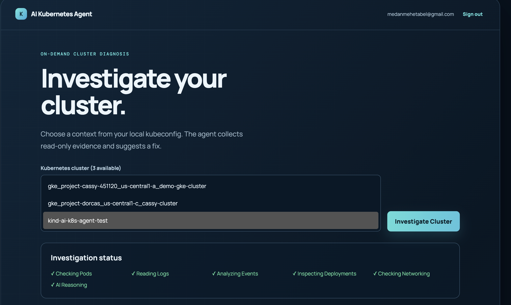
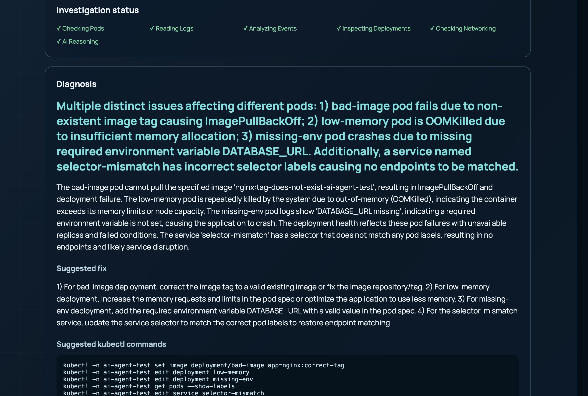
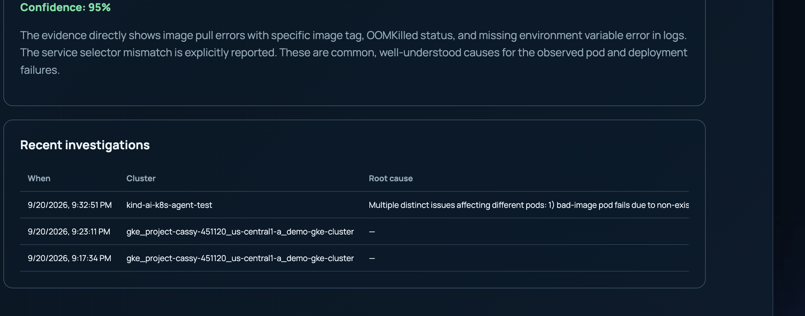

# AI Kubernetes Troubleshooting Agent

An on-demand troubleshooting UI backed by FastAPI. The backend collects read-only Kubernetes evidence with `kubectl` and can request a diagnosis from OpenRouter. It does not apply fixes to a cluster.

## Screenshots

The local `kind-ai-k8s-agent-test` run completed all investigation stages and identified the four intentional failure scenarios.

**Cluster selection and investigation progress**



**AI diagnosis and suggested fixes**



**Confidence and investigation history**



## Run locally with Docker

1. Create local environment files if they are not already present:

   ```sh
   cp backend/.env.example backend/.env
   cp frontend/.env.local.example frontend/.env.local
   ```

2. Set `OPENROUTER_API_KEY` and `OPENROUTER_MODEL` in `backend/.env` to enable AI diagnoses. Set the same long random `BACKEND_INTERNAL_TOKEN` in both environment files. Set `NEXT_PUBLIC_INSFORGE_URL` and `NEXT_PUBLIC_INSFORGE_ANON_KEY` in `frontend/.env.local` for your InsForge project. Keep these files out of Git.
3. Apply `migrations/20260920141417_investigation-history.sql` to the linked InsForge project after reviewing the ownership and realtime policies. The dashboard needs this table to save investigations and show progress.
4. Build and start the stack:

   ```sh
   docker compose --env-file frontend/.env.local up --build -d
   docker compose ps
   curl -fsS http://localhost:8000/health
   docker compose exec backend kubectl version --client
   ```

5. Open [the UI](http://localhost:3000), sign in, choose a kubeconfig context, and investigate. Stop it with `docker compose down`.

The UI and health endpoint can start without Kubernetes access or an OpenRouter key. Investigations need a reachable cluster; missing model configuration returns a partial result with collected evidence. The browser calls the protected Next.js API, which passes a private token to FastAPI. The `NEXT_PUBLIC_INSFORGE_*` variables are embedded during the frontend build, so rebuild after changing them.

## Give the backend cluster access

The default Compose file does not mount host Kubernetes credentials. For a self-contained kubeconfig that works inside the container, set the path to its file on the host and use the optional override:

```sh
export KUBECONFIG_HOST_PATH=/absolute/path/to/kubeconfig

docker compose --env-file frontend/.env.local -f docker-compose.yml -f docker-compose.kubeconfig.yml up --build -d
```

The mount is read-only. The active GKE kubeconfig on this Mac invokes a macOS authentication helper, so mounting that file directly will not work in Linux. For a local smoke test, first renew your host login, then create a temporary kubeconfig containing a short-lived access token:

```sh
gcloud auth login --force
kubectl get namespaces
export KUBECONFIG_HOST_PATH="$(python3 scripts/create_gke_kubeconfig.py)"
docker compose --env-file frontend/.env.local -f docker-compose.yml -f docker-compose.kubeconfig.yml up -d --build
docker compose -f docker-compose.yml -f docker-compose.kubeconfig.yml exec -T -e KUBECONFIG=/run/kube/config backend kubectl get namespaces
```

The helper preserves all contexts in the host kubeconfig, replacing the macOS GKE auth helper with one short-lived token where needed. It also makes loopback API endpoints such as kind reachable from Docker while preserving TLS validation. It writes only to a permission-restricted temporary file and prints its path. The GKE token expires, so generate a new file when a later session needs cluster access. When finished, run `docker compose -f docker-compose.yml -f docker-compose.kubeconfig.yml down` and `rm -f "$KUBECONFIG_HOST_PATH"`. The token retains the signed-in account's permissions; use a dedicated read-only identity or RBAC grant before broader use.

## Test with a local cluster

When a cloud cluster is unavailable, [install kind](https://kind.sigs.k8s.io/docs/user/quick-start/#installation) and create an isolated Docker cluster:

```sh
kind create cluster --name ai-k8s-agent-test --kubeconfig /tmp/ai-k8s-agent-kind.kubeconfig
export KUBECONFIG=/tmp/ai-k8s-agent-kind.kubeconfig
export KUBECONFIG_HOST_PATH="$(python3 scripts/create_gke_kubeconfig.py)"
docker compose --env-file frontend/.env.local -f docker-compose.yml -f docker-compose.kubeconfig.yml up -d --build
kubectl --kubeconfig /tmp/ai-k8s-agent-kind.kubeconfig apply -f scenarios/
```

Choose `kind-ai-k8s-agent-test` in the dashboard. To show kind alongside your existing host contexts, set `KUBECONFIG="$HOME/.kube/config:/tmp/ai-k8s-agent-kind.kubeconfig"` before running the helper; GKE contexts need a valid `gcloud` login. The four workloads intentionally fail in the `ai-agent-test` namespace. Delete that namespace and the cluster when testing is complete.

The backend image defaults to `kubectl` v1.36.1. Set `KUBECTL_VERSION` before building if the cluster requires another compatible version. [Kubernetes recommends keeping the client within one minor version of the control plane](https://kubernetes.io/docs/tasks/tools/install-kubectl-linux/).

Use the manifests in `scenarios/` to test CrashLoopBackOff, ImagePullBackOff, OOMKilled, and a service selector mismatch in an authorized test cluster. Each manifest is read-only to the agent; applying the scenarios intentionally creates broken workloads.

## Structure

```text
backend/    FastAPI, Kubernetes evidence collection, and AI diagnosis
frontend/   Next.js UI
docs/       Design notes
prompts/    Prompt assets
```

Never commit API keys, kubeconfig files, or local `.env` files.
